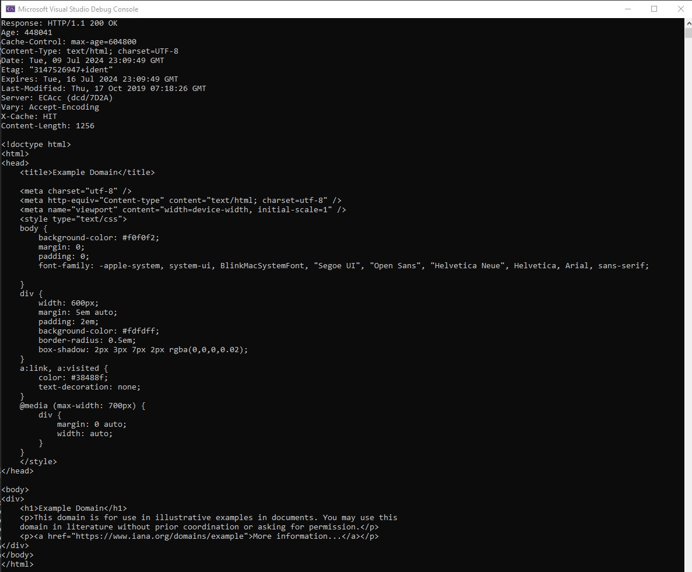
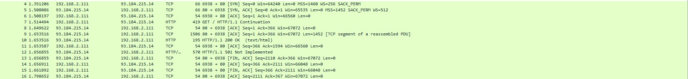
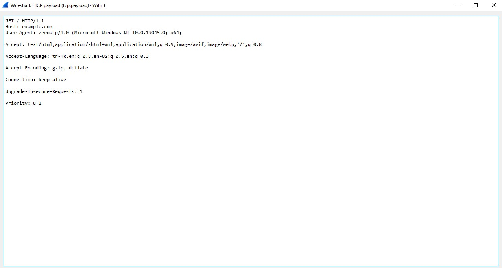
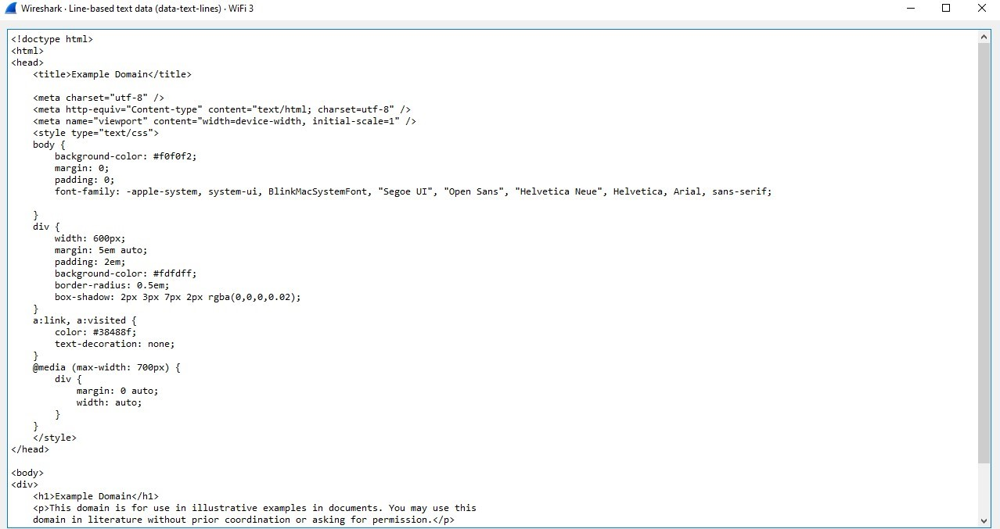

# HttpGetterSharp

HttpGetterSharp is a lightweight C# library designed for sending HTTP GET requests and efficiently handling responses. It simplifies the process of making HTTP requests and processing the returned data in C# applications.
You can simply and quickly create and send http get requests and receive their responses.

## Key Features

- Generate custom or pre-defined HTTP request formats for your HTTP requests.
- Send an HTTP GET request.
- Capture and process the HTTP response returned from the server.

## Example Usage (For quick use)

```csharp
 static async Task Main(string[] args)
 {


     HttpGetRequestBuilder getRequestBuilder = new HttpGetRequestBuilder();
     string hostName = "example.com";
     StringBuilder request = getRequestBuilder.BuildRequest(hostName);
     HttpConnectionService httpConnection = new HttpConnectionService(hostName);
     bool isConnected = await httpConnection.CreateHttpConnection();
     if (!isConnected)
     {
         Console.WriteLine("Connection could not be created.");
         return;
     }

     try
     {
         await httpConnection.SendHttpRequest(request.ToString());
         Console.WriteLine($"Response: {await httpConnection.ReceiveHttpResponse()}");
         await httpConnection.CloseHttpConnection();
     }
     catch (Exception ex)
     {
         Console.WriteLine($"An error occurred: {ex.Message}");
     }
 }
```

## Console Output

```bash
Response: HTTP/1.1 200 OK
Age: 448041
Cache-Control: max-age=604800
Content-Type: text/html; charset=UTF-8
Date: Tue, 09 Jul 2024 23:09:49 GMT
Etag: "3147526947+ident"
Expires: Tue, 16 Jul 2024 23:09:49 GMT
Last-Modified: Thu, 17 Oct 2019 07:18:26 GMT
Server: ECAcc (dcd/7D2A)
Vary: Accept-Encoding
X-Cache: HIT
Content-Length: 1256

<!doctype html>
<html>
<head>
    <title>Example Domain</title>

    <meta charset="utf-8" />
    <meta http-equiv="Content-type" content="text/html; charset=utf-8" />
    <meta name="viewport" content="width=device-width, initial-scale=1" />
    <style type="text/css">
    body {
        background-color: #f0f0f2;
        margin: 0;
        padding: 0;
        font-family: -apple-system, system-ui, BlinkMacSystemFont, "Segoe UI", "Open Sans", "Helvetica Neue", Helvetica, Arial, sans-serif;

    }
    div {
        width: 600px;
        margin: 5em auto;
        padding: 2em;
        background-color: #fdfdff;
        border-radius: 0.5em;
        box-shadow: 2px 3px 7px 2px rgba(0,0,0,0.02);
    }
    a:link, a:visited {
        color: #38488f;
        text-decoration: none;
    }
    @media (max-width: 700px) {
        div {
            margin: 0 auto;
            width: auto;
        }
    }
    </style>
</head>

<body>
<div>
    <h1>Example Domain</h1>
    <p>This domain is for use in illustrative examples in documents. You may use this
    domain in literature without prior coordination or asking for permission.</p>
    <p><a href="https://www.iana.org/domains/example">More information...</a></p>
</div>
</body>
</html>
```

## Example Output (Console Screenshot)



## Example Output (Wireshark Screenshot)

### 1-) All packets sent and received :



### 2-) Get request packet :



### 3-) Received package content :



## Example Usage (For customized header)

```csharp
 static async Task Main(string[] args)
 {


     HttpGetRequestBuilder getRequestBuilder = new HttpGetRequestBuilder();
     string hostName = "example.com";
     Dictionary<string, string> keyValues = new Dictionary<string, string>();
     HttpConnectionService httpConnection = new HttpConnectionService(hostName);
     keyValues.Add("User-Agent", "zeroalp Customizeee\r\n");
     keyValues.Add("Accept", "text/html,application/xhtml+xml,application/xml;q=0.9,image/avif,image/webp,*/*;q=0.8\r\n");
     keyValues.Add("Accept-Language", "en-US,en;q=0.8,en-US;q=0.5,en;q=0.3\r\n");
     keyValues.Add("Accept-Encoding", "gzip, deflate\r\n");
     keyValues.Add("Connection", "keep-alive\r\n");
     keyValues.Add("Upgrade-Insecure-Requests", "1\r\n");
     keyValues.Add("Priority", "u=1\r\n");
     StringBuilder request = getRequestBuilder.BuildRequest(hostName, "1.1", keyValues);
     bool isConnected = await httpConnection.CreateHttpConnection();
     if (!isConnected)
     {
         Console.WriteLine("Connection could not be created.");
         return;
     }

     try
     {
         await httpConnection.SendHttpRequest(request.ToString());
         Console.WriteLine($"Response: {await httpConnection.ReceiveHttpResponse()}");
         await httpConnection.CloseHttpConnection();
     }
     catch (Exception ex)
     {
         Console.WriteLine($"An error occurred: {ex.Message}");
     }
 }
```

## License

HttpGetterSharp is licensed under the MIT License. See the LICENSE file for details.
